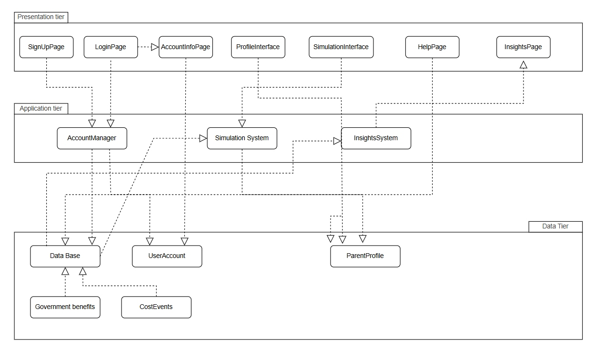

# Game of Life
<p align="center">
    
</p>

## Project Vision

The "Game of Life" is a financial planning application designed to assist Singaporean families with budgeting for parenthood. It provides two main tools:

- A real-time, interactive Life Simulator (LifeSim) to visualize the financial journey of raising one child from birth to adulthood, including dynamic costs and decision-making
- A high-level Insights Generator to project the total estimated costs for raising multiple children in Singapore

This project aims to bridge the gap between abstract financial data and the tangible, long-term financial reality of raising a family in Singapore, using up-to-date government data for subsidies, taxes, and fees where possible.

## Core Features

Game Of Life features are divided into several key modules:

### Authentication System

- Secure user sign-up and sign-in with email and password
- Password validation (12+ characters, complex)
- Google Account (OAuth) integration for one-click sign-in
- Password reset functionality via email

### Guest Mode

- Ability to use the application without registering ("Play as Guest")
- All profile and simulation data is saved locally in the browser's localStorage
- Data is automatically cleared on "Logout" to ensure privacy

### Family Profile Creation

- A detailed form to capture the family's financial starting point
- Collects data on parent residency (Citizen/PR), gross vs. disposable income, and initial family savings
- Captures child-specific information (name, gender) and a "Realism Level" (Optimistic, Neutral, Pessimistic) to adjust simulation costs
- Profile data is saved to Firestore for registered users and localStorage for guests

### Real-Time Life Simulator

- A "play-by-play" simulation that progresses from Age 0 to 22 (264 months)
- The simulation runs on a "game clock" with adjustable speed (0.1x to 6x)
- Dynamically deducts monthly education and miscellaneous costs (e.g., food, transport, medical) from household savings
- Adds monthly parental income to household savings
- If household savings drop to zero, the simulation ends automatically

### Dynamic Event & Decision System

The simulation pauses at key milestones to present the user with notifications or decisions:

- **Notification Events**: Automatically grant government benefits like the Baby Bonus, CDA grant, and annual Edusave contributions
- **Financial Events**: Automatically calculates and deducts annual income tax, factoring in reliefs like QCR and WMCR to show tax savings
- **Decision Events**: The user must make one-time financial choices, such as enrolling in enrichment classes, buying a laptop, or approving an overseas trip
- **Path-Branching Decision**: At age 16, the user must choose between the "Junior College" or "Polytechnic" education path, which alters the simulation's duration and costs

### Simulation Dashboard

Upon completion (or manual end) of the simulation, a detailed dashboard is generated:

- **Summary Cards**: Show total expenditure, total benefits received, and total miscellaneous costs
- **Bar Charts**: Provide breakdowns of total cost by life stage (e.g., Newborn, Primary) and education costs by stage
- **Pie Charts**: Visualize the breakdown of total expenditure (Education vs. Medical vs. Misc), total miscellaneous costs (e.g., Clothing, Diapers, Enrichment), and total government benefits (e.g., Baby Bonus, Edusave, Tax Relieved)
- **Data Export**: All dashboard data can be exported as a `.csv` file, including a log of all one-time decisions made

### Insights Generator

- A separate tool for high-level "what-if" analysis
- The user inputs the number of children (1, 2, or 3) and a preferred education path
- It calculates the total lifetime cost for that scenario, presenting it as a financial range (e.g., "$172,000 - $210,000")
- Also generates charts for cost vs. benefits and expenditure breakdowns for the chosen scenario

## System Architecture

The project is a modern web application built on a Layered Component-Based Architecture (React/Next.js) with a Backend-as-a-Service (BaaS) model (Firebase).

<p align="center">
    
</p>

### Class Diagram

This diagram models the React components, pages, and service modules as classes to illustrate their relationships and dependencies.

<p align="center">
    
</p>

### Data and Storage Model

The application operates in two distinct data modes:

**Guest Mode:**
- **Storage**: localStorage (Browser)
- **Management**: The static `GuestStorageManager` class is responsible for all localStorage interactions (CRUD operations)
- **Persistence**: Data persists as long as the browser cache is not cleared. It is explicitly deleted when the user "logs out" of the guest session
- **Data**: `guest_id`, `guest_profile`, and `guest_simulations` are all stored as JSON strings in localStorage

**Registered User Mode:**
- **Storage**: Google Firebase (Cloud)
- **Authentication**: Firebase Auth handles user identity, with logic abstracted into `src/lib/authHelpers.js`
- **Database**: Cloud Firestore stores user-related data (profiles, saved simulations)
- **Management**: All database operations (CRUD) are abstracted into `src/lib/firestoreHelpers.js`
- **Persistence**: Data is permanent and tied to the user's account

### Key Modules & Components

- `src/lib/firebase.js`: Initializes and exports the singleton instances of Firebase Auth and Firestore, reading environment variables to connect to the correct project
- `src/lib/data.js`: The core "business logic" engine. It's a module of pure functions that fetches live data from data.gov.sg APIs (e.g., `getChildcareFees`, `calculateTax`) and provides hardcoded data for government schemes (e.g., `getBabyBonus`, `getChildcareSubsidy`)
- `src/components/LifeSim.js`: The main simulation controller. This component manages the core simulation loop (`setInterval`), state (age, savings), event checking (`generateCostEvent`), and monthly cost calculations (`calculateMonthlyCosts`)
- `src/app/Profile_Page/page.js`: A page that acts as a controller for handling both guest and registered user profiles. It validates and saves profile data to either localStorage (via `GuestStorageManager`) or Firestore (via `firestoreHelpers`)

## Technical Stack

| Category | Technology |
|----------|-----------|
| Framework | Next.js |
| UI Library | React |
| Styling | Tailwind CSS |
| Backend & Auth | Firebase |
| Database | Cloud Firestore |
| Data Visualization | Recharts |
| Linting | ESLint |

## Getting Started

Follow these instructions to set up and run the project locally for development.

### Prerequisites

- Node.js (v18.18.0 or later)
- npm (v9 or later)
- A Firebase project with Authentication (Email/Pass, Google) and Firestore enabled

### Installation & Setup

Clone the repository:

```bash
git clone https://github.com/your-username/game-of-life.git
cd game-of-life/gameoflife
```

Install dependencies:

```bash
npm install
```

Configure Environment Variables:

This project connects to Firebase, which requires API keys. Create a file named `.env.local` in the `gameoflife/` directory.

```bash
touch .env.local
```

Paste the following into the file, replacing the `...` with your actual Firebase project credentials:

```
NEXT_PUBLIC_FIREBASE_API_KEY=...
NEXT_PUBLIC_FIREBASE_AUTH_DOMAIN=...
NEXT_PUBLIC_FIREBASE_PROJECT_ID=...
NEXT_PUBLIC_FIREBASE_STORAGE_BUCKET=...
NEXT_PUBLIC_FIREBASE_MESSAGING_SENDER_ID=...
NEXT_PUBLIC_FIREBASE_APP_ID=...
```

### Running the Application

Once installed and configured, run the development server:

```bash
npm run dev
```

The application will be available at http://localhost:3000. The console will show a debug message indicating if the Firebase config was loaded successfully.

## Project Structure

This tree outlines the organization of the `src` folder, which contains all the application's source code.

```
src/
├── app/
│   ├── Landing_Page/
│   │   └── page.js         # Main landing, login, and signup logic
│   ├── Profile_Page/
│   │   └── page.js         # The profile creation form component
│   ├── Life_Sim_Page/
│   │   └── page.js         # Page that hosts and manages the simulation
│   └── Insights_Page/
│       └── page.js         # The insights/projection calculator page
│
├── components/
│   ├── ConditionalNavbar.js  # Logic to show/hide navbar
│   ├── ForgotPassword.js     # Password reset modal
│   ├── Help_popup.js         # The help/disclaimer modal
│   ├── LifeSim.js            # The core simulation engine/component
│   ├── LifeSimDashboard.js   # The dashboard component (charts)
│   ├── Login.js              # Reusable login form
│   ├── Logo.js               # Application logo component
│   ├── Navbar.js             # Main navigation bar
│   ├── Sign_Up.js            # Reusable signup form
│   └── User_Account.js       # The "logged in" user/guest info card
│
├── lib/
│   ├── authHelpers.js      # All Firebase Auth logic
│   ├── data.js             # All financial & gov data
│   ├── firebase.js         # Firebase app initialization
│   └── firestoreHelpers.js # All Firestore DB logic
│
└── utils/
    └── guestStorage.js     # Manages guest data in localStorage
```

## Disclaimer

- **No Financial Advice**: This application is not a substitute for professional financial advice. The data is for general guidance only
- **Verification**: For the most accurate and up-to-date information on government benefits and schemes, users are encouraged to consult the relevant government agencies and support services directly
